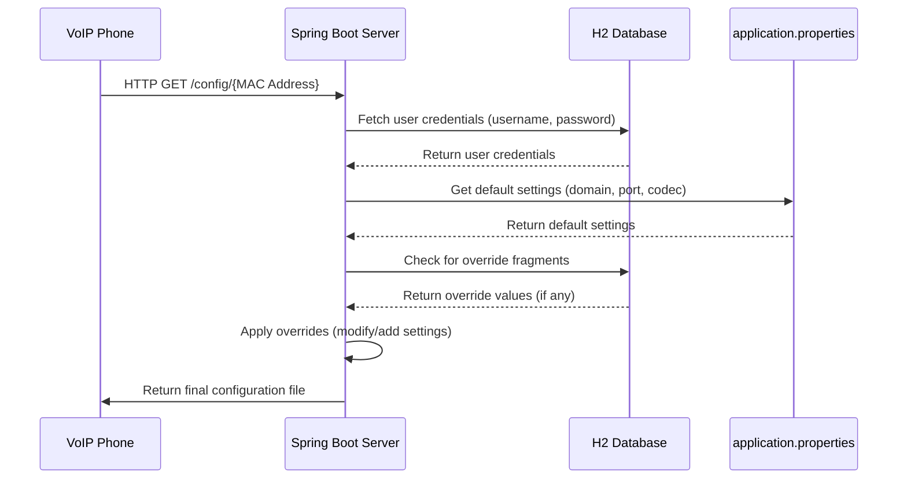

# VoIP Provisioning System Architecture

## Overview

The VoIP Provisioning System is a Spring Boot application that dynamically generates configuration files for different types of VoIP devices. When a device boots up, it sends an HTTP request with its MAC address, and the server responds with a configuration file formatted specifically for that device type.

## Key Components

### 1. Controller Layer
- `ProvisioningController`: Handles HTTP requests for device provisioning
- Responsible for input validation, content type determination, and response generation

### 2. Service Layer
- `ProvisioningService`: Coordinates the process of finding devices and generating configurations
- Handles business logic and delegates to appropriate components

### 3. Repository Layer
- `DeviceRepository`: JPA repository for accessing device data
- Provides methods to retrieve device information by MAC address

### 4. Provisioning Strategy
- `DeviceProvisioner`: Interface defining the contract for device-specific provisioning
- `DeskPhoneProvisioner`: Implementation for desk phones (property file format)
- `ConferencePhoneProvisioner`: Implementation for conference phones (JSON format)
- `DeviceProvisionerFactory`: Factory that selects the appropriate provisioner based on device model

### 5. Configuration
- `ProvisioningConfig`: Holds application-wide configuration properties
- Provides access to domain, port, and codec settings

## Data Flow

1. Device sends HTTP GET request to `/api/v1/provisioning/{macAddress}`
2. Controller validates the MAC address format
3. Service looks up the device in the repository
4. If found, the factory selects the appropriate provisioner based on device model
5. Provisioner generates the configuration, applying any override fragments
6. Controller determines the content type and returns the configuration



## Extension Points

The system is designed for easy extension with new device types:

1. Add a new enum value to `Device.DeviceModel`
2. Create a new implementation of `DeviceProvisioner`
3. The system will automatically register it through component scanning

## Error Handling

- `DeviceNotFoundException`: Thrown when a device with the given MAC address is not found
- `GlobalExceptionHandler`: Provides centralized exception handling
- HTTP status codes indicate the type of error (400, 404, 500)

## Testing Strategy

- Unit tests for individual components
- Integration tests for end-to-end functionality
- Test coverage for both normal operation and error conditions

## Security Considerations

- Input validation for MAC addresses
- Appropriate error messages that don't expose system details
- Logging of access attempts for audit purposes

## Application Structure

```
provisioning-hw/
├── src/
│   ├── main/
│   │   ├── java/
│   │   │   └── com/
│   │   │       └── voxloud/
│   │   │           └── provisioning/
│   │   │               ├── config/
│   │   │               │   └── ProvisioningConfig.java
│   │   │               ├── controller/
│   │   │               │   └── ProvisioningController.java
│   │   │               ├── entity/
│   │   │               │   └── Device.java
│   │   │               ├── exception/
│   │   │               │   ├── DeviceNotFoundException.java
│   │   │               │   └── GlobalExceptionHandler.java
│   │   │               ├── health/
│   │   │               │   └── ProvisioningHealthIndicator.java
│   │   │               ├── provisioner/
│   │   │               │   ├── ConferencePhoneProvisioner.java
│   │   │               │   ├── DeskPhoneProvisioner.java
│   │   │               │   ├── DeviceProvisioner.java
│   │   │               │   └── DeviceProvisionerFactory.java
│   │   │               ├── repository/
│   │   │               │   └── DeviceRepository.java
│   │   │               ├── service/
│   │   │               │   ├── ProvisioningService.java
│   │   │               │   └── ProvisioningServiceImpl.java
│   │   │               ├── util/
│   │   │               │   └── MacAddressValidator.java
│   │   │               └── ProvisioningApplication.java
│   │   └── resources/
│   │       ├── application.properties
│   │       ├── bootstrap.yml
│   │       ├── data.sql
│   │       └── logback-spring.xml
│   └── test/
│       └── java/
│           └── com/
│               └── voxloud/
│                   └── provisioning/
│                       ├── controller/
│                       │   └── ProvisioningControllerTest.java
│                       ├── provisioner/
│                       │   └── ProvisionerTest.java
│                       ├── service/
│                       │   └── ProvisioningServiceImplTest.java
│                       ├── ProvisioningApplicationTests.java
│                       └── ProvisioningIntegrationTest.java
├── .gitignore
├── ARCHITECTURE.md
├── README.md
└── pom.xml
```