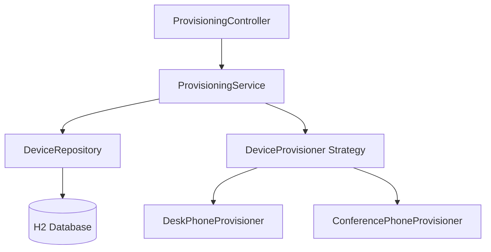
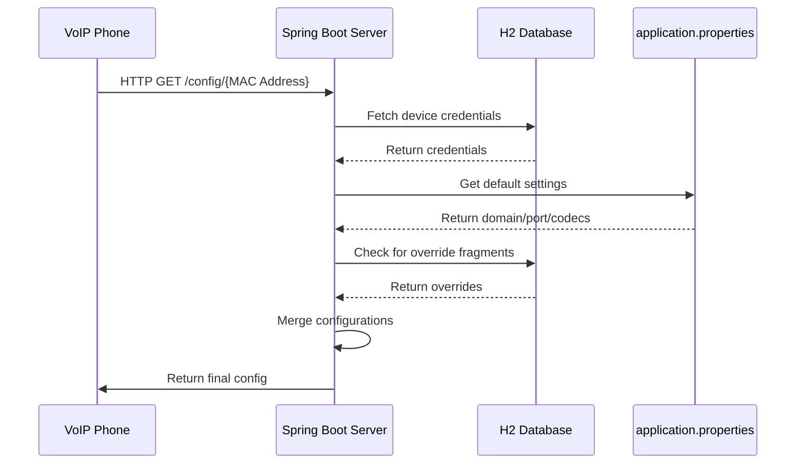

# 📞 VoIP Provisioning Server
[](https://openjdk.org/)
[](https://spring.io/projects/spring-boot)
[](https://www.h2database.com/)

## 📄 Context
Provisioning, in the context of VoIP and other telecommunication, means providing an automated process to make a device able to connect and configure itself to be enabled to make and receive calls. This normally happens when the device is plugged and boots up, connecting to a central server that releases the needed configuration. The scope of this application is to create a simple provisioning server that is able to generate dynamically the needed configuration for every device type. Automated VoIP device configuration server that dynamically generates device-specific configuration files for Desk and Conference phones, with support for real-time configuration overrides.

---

## 🚀 Features
✅ **Device-Specific Configuration**  
- Property files for Desk phones
- JSON configurations for Conference phones

✅ **Real-Time Overrides**  
- Database-stored override fragments (supports both property and JSON formats)
- Seamless merging of default and override configurations

✅ **Error Handling**  
- HTTP 404 for unknown devices
- Graceful fragment parsing with error logging

✅ **Tech Stack**  
- Spring Boot 3.4.4
- Jakarta EE 10
- H2 In-Memory Database
- Java 21

---

## 🏗️ Architecture

### Key Components
#### 1. Controller Layer
- `ProvisioningController`: Handles HTTP requests for device provisioning
- Responsible for input validation, content type determination, and response generation

#### 2. Service Layer
- `ProvisioningService`: Coordinates the process of finding devices and generating configurations
- Handles business logic and delegates to appropriate components

#### 3. Repository Layer
- `DeviceRepository`: JPA repository for accessing device data
- Provides methods to retrieve device information by MAC address

#### 4. Provisioning Strategy
- `DeviceProvisioner`: Interface defining the contract for device-specific provisioning
- `DeskPhoneProvisioner`: Implementation for desk phones (property file format)
- `ConferencePhoneProvisioner`: Implementation for conference phones (JSON format)
- `DeviceProvisionerFactory`: Factory that selects the appropriate provisioner based on device model

#### 5. Configuration
- `ProvisioningConfig`: Holds application-wide configuration properties
- Provides access to domain, port, and codec settings



### Data Flow

1. Device sends HTTP GET request to `/api/v1/provisioning/{macAddress}`
2. Controller validates the MAC address format
3. Service looks up the device in the repository
4. If found, the factory selects the appropriate provisioner based on device model
5. Provisioner generates the configuration, applying any override fragments
6. Controller determines the content type and returns the configuration


### Extension Points
1. **New Device Types**
  - Add new enum value to `DeviceModel`
  - Create new `DeviceProvisioner` implementation
  - Automatically registered via Spring component scanning

2. **Configuration Sources**
  - Extend `ProvisioningConfig` for new parameters
  - Add new override parsers for custom formats

---

## 📦 Project Structure
```plaintext
.
├── src/main/java/com/voxloud/provisioning
│   ├── controller/      # REST API endpoints
│   ├── entity/          # JPA entities
│   ├── provisioner/     # Provisioner factory
│   ├── repository/      # Database layer
│   ├── service/         # Business logic
│   └── exception/       # Custom exceptions
└── src/main/resources
    ├── application.properties  # Configuration
    └── data.sql         # Sample device data
```

---

## ⚙️ Implementation Details
### Strategy Pattern Implementation
```java
// DeviceProvisioner.java
public interface DeviceProvisioner {
    String generateConfiguration(Device device, Properties defaults);
}

// DeskPhoneProvisioner.java
@Component
public class DeskPhoneProvisioner implements DeviceProvisioner {
    @Override
    public String generateConfiguration(Device device, Properties defaults) {
        // Property file generation logic
    }
}

// ConferencePhoneProvisioner.java
@Component
public class ConferencePhoneProvisioner implements DeviceProvisioner {
    @Override
    public String generateConfiguration(Device device, Properties defaults) {
        // JSON generation logic
    }
}
```

### Configuration Merging Strategy
1. Base properties from `application.properties`
2. Database credentials override
3. Override fragment applies last (supports both formats)

---

## 🛠️ Quick Start
1. **Clone the repository**
```bash
git clone https://github.com/rhadiwib/provisioning-hw.git
cd provisioning-hw
```

2. **Build and run**
```bash
mvn spring-boot:run
```

3. **Access H2 Console**  
   URL: http://localhost:8080/h2-console  
   JDBC URL: `jdbc:h2:mem:test`  
   User: `sa` / Password: `password`

---

## 🧪 Testing
Run the test suite:
```bash
./results.sh
```

Sample output:
```plaintext
--- Desk phone without override fragment ---
username=john
password=doe
domain=sip.voxloud.com
port=5060
codecs=G711,G729,OPUS

--- Conference phone with override fragment ---
{
  "username": "eric",
  "password": "blue",
  "domain": "sip.anotherdomain.com",
  "port": "5161",
  "codecs": ["G711", "G729", "OPUS"],
  "timeout": 10
}
```

please refer to `demo` directory

---

## 📝 Configuration
`application.properties` contains:
```properties
provisioning.domain=sip.voxloud.com
provisioning.port=5060
provisioning.codecs=G711,G729,OPUS
```

---

## ⚠️ Error Handling
- **404 Not Found**: Invalid MAC address
- **400 Bad Request**: Malformed override fragment
- **500 Internal Error**: Database connection issues

---
